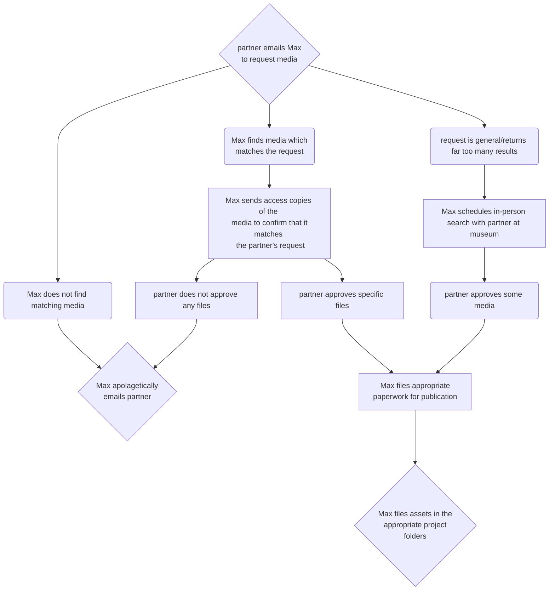
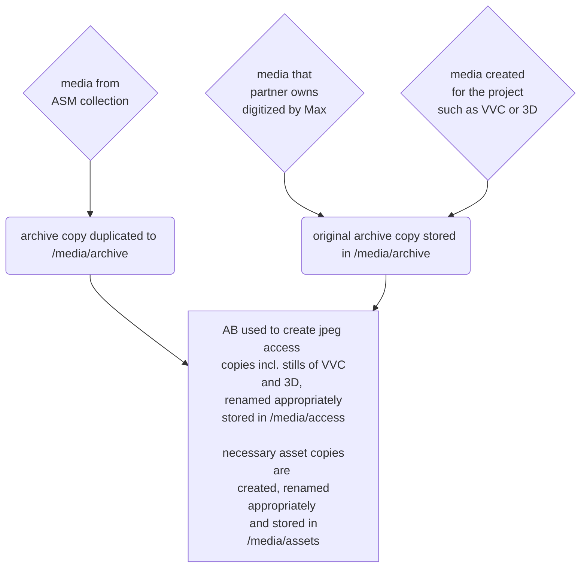

# Media Delivery Workflows

##  Partners delivering their own media to dev team
![image](https://mermaid.ink/img/eyJjb2RlIjoiZ3JhcGggVERcblxuJSUlIE5PREUgREVGSU5JVElPTlNcblxuJSUgbWVkaWEgaW50YWtlIG5vZGVcbmlkMXtzdGFrZWhvbGRlciBlbWFpbHMgTWF4IDxicj4gdG8gcmVxdWVzdCBtZWRpYX1cblxuJSUgc3Vibm9kZXMgZm9yIG1lZGlhIHR5cGVzXG5pZDEuMShNYXggZmluZHMgbWVkaWEgd2hpY2ggPGJyPiBtYXRjaGVzIHRoZSByZXF1ZXN0KVxuaWQxLjIoTWF4IGRvZXMgbm90IGZpbmQgbWF0Y2hpbmcgbWVkaWEpXG5cbiUlIG1lZGlhIGRlc3RpbmF0aW9uIDAxXG5pZDJbTWF4IHNlbmRzIGFjY2VzcyBjb3BpZXMgb2YgdGhlIDxicj4gbWVkaWEgdG8gY29uZmlybSB0aGF0IGl0IG1hdGNoZXMgPGJyPiB0aGUgc3Rha2Vob2xkZXIncyByZXF1ZXN0XVxuaWQyLjF7TWF4IGFwb2xhZ2V0aWNhbGx5IDxicj4gZW1haWxzIHN0YWtlaG9sZGVyfVxuaWQyLjJbc3Rha2Vob2xkZXIgYXBwcm92ZXMgc3BlY2lmaWMgZmlsZXNdXG5pZDIuM1tzdGFrZWhvbGRlciBkb2VzIG5vdCBhcHByb3ZlIGFueSBmaWxlc11cbmlkMi40W01heCBmaWxlcyBhcHByb3ByaWF0ZSA8YnI-IHBhcGVyd29yayBmb3IgcHVibGljYXRpb25dXG5cbiUlIGNvbmNsdXNpb25cbmlkNHtNYXggZmlsZXMgYXNzZXRzIGluIHRoZSA8YnI-IGFwcHJvcHJpYXRlIHByb2plY3QgPGJyPiBmb2xkZXJzLn1cblxuJSUgZGlhZ3JhbVxuaWQxIC0tPiBpZDEuMSAmIGlkMS4yXG5pZDEuMSAtLT4gaWQyIC0tPiBpZDIuMiAmIGlkMi4zIFxuaWQxLjIgLS0-IGlkMi4xXG5pZDIuMiAtLT4gaWQyLjRcbmlkMi4zIC0tPiBpZDIuMVxuaWQyLjQgLS0-IGlkNFxuIiwibWVybWFpZCI6eyJ0aGVtZSI6ImRlZmF1bHQifSwidXBkYXRlRWRpdG9yIjpmYWxzZSwiYXV0b1N5bmMiOnRydWUsInVwZGF0ZURpYWdyYW0iOmZhbHNlfQ)
 

--- 

# Partners requesting media from ASM

 

--- 

# General Post-Intake Workflow

 

---

