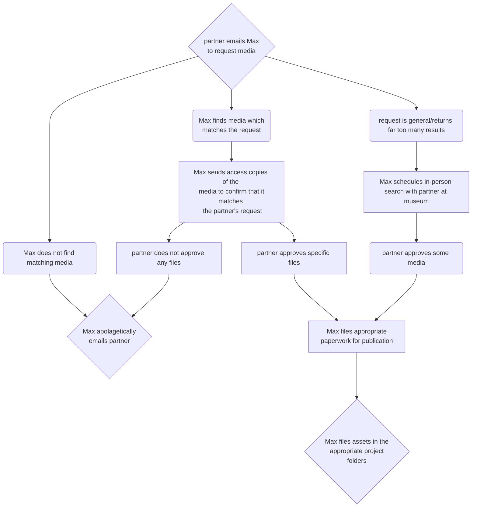
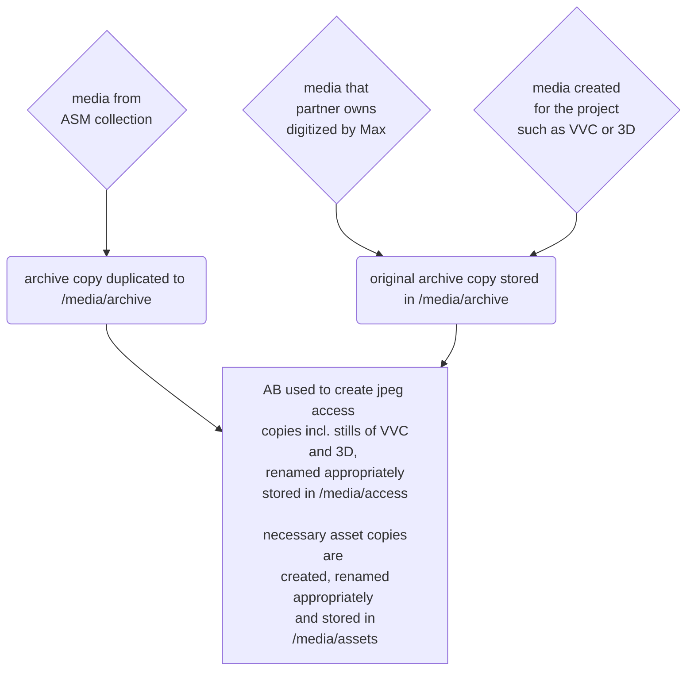

# Media Delivery Workflows

##  Partners delivering their own media to dev team

graph TD

%%% NODE DEFINITIONS

%% media intake node
id1{incoming media}

%% subnodes for media types
id1.1(images)
id1.2(video)
id1.3(text)

%% media destination 01
id2[upload files to   appbox
id2.1[email as attachment to Max]
id2.2[email Max to tell them what the file is]

%% consent
id3[Max replies to confirm receipt   and file metadata as well    as to request formal consent   to archive and share data]

%% conclusion
id4{partner returns   signed consent form   and Max files assets in the   appropriate project   folders}
%% diagram
id1 --> id1.1 & id1.3 & id1.2
id1.1 & id1.2 --> id2 --> id2.2
id1.3 --> id2.1
id2.1 & id2.2 --> id3
id3 --> id4

 

--- 

# Partners requesting media from ASM

 

--- 

# General Post-Intake Workflow

 

---

